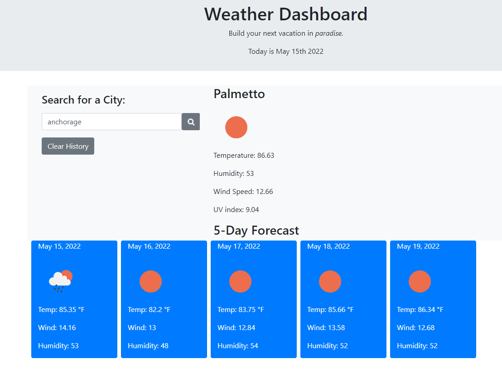

# Weather Dashboard

## Table of Contents

1. [Descripton](#description)
2. [Installation](#installation)
3. [Testing](#Testing)
4. [Live Site and Repo](#live-site-and-repo)
5. [License](#license)
6. [Contributers](#contributers)

## Description

An app that displays the weather for *any* location. Plan your next vacation in paradise.

## Installation

* Use Live Server

## Testing

## Live Site and Repo

* View live site [here](https://angelagola-ko.github.io/Weather-Dashboard/)
* View repo [here](https://github.com/angelagola-ko/Weather-Dashboard)

## License

 * .

## Contributers

* Angela Gola Send email: [here](mailto:angelagola.ko@gmail.com).
